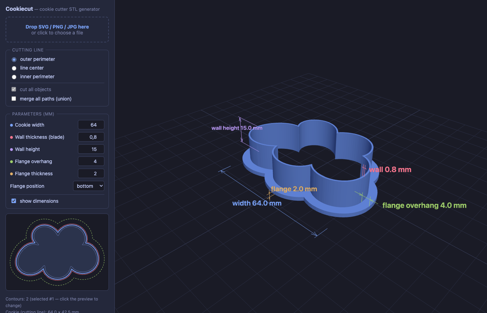

# 🍪 Cookiecut

**Turn any shape into a 3D-printable cookie cutter.**

Drop in an SVG, PNG or JPG and download a print-ready STL — cutting walls,
pressing flange and all. Everything runs in your browser; nothing is uploaded
anywhere.

### ▶︎ [Open the app → tedyno.github.io/cookiecut](https://tedyno.github.io/cookiecut/)



## Features

- **SVG input** — `path`, `rect`, `circle`, `ellipse`, `polygon`; stroke-only
  icons (`fill="none"`) are expanded to outlines of the stroke width
- **PNG / JPG / WebP input** — vectorized live with a tunable brightness
  threshold, inversion, simplification and smoothing
- **Multiple objects at once** — every standalone shape becomes its own
  cutter, layout preserved; flanges are clipped against neighbours so they
  never collide. Or click a single contour in the 2D preview to cut just that
- **Cutting line choice** for stroked outlines: outer perimeter, line center
  or inner perimeter
- **Parametric** — cookie width, wall thickness & height, flange overhang,
  thickness and position (bottom/top), all with live dimension annotations
  in the 3D preview
- **Watertight STL by construction** — shells are built from constrained
  Delaunay caps (cdt2d) and clipper offsets
- **Fast** — geometry runs in a Web Worker, rebuilds take ~200 ms

## Running locally

```sh
bun install
bun run dev        # dev server with hot reload, http://localhost:3000
bun run build      # static build into dist/
```

Built with [bun](https://bun.sh), TypeScript, [three.js](https://threejs.org),
[clipper-lib](https://www.npmjs.com/package/clipper-lib) and
[cdt2d](https://www.npmjs.com/package/cdt2d) — no server, no CDN, local
dependencies only.

## How it works

1. **Extract contours** — SVG shapes are sampled via `getPointAtLength`;
   rasters are thresholded and traced with marching squares
2. **Pick cutting lines** — containment analysis finds standalone objects
   and their inner outlines
3. **Offset & clip** — clipper builds the wall and flange rings; in
   multi-object mode flanges are clipped against neighbours
4. **Build solids** — vertical strips + constrained-Delaunay caps assemble
   watertight shells, no 3D booleans needed
5. **Export** — binary STL in millimetres, z-up
